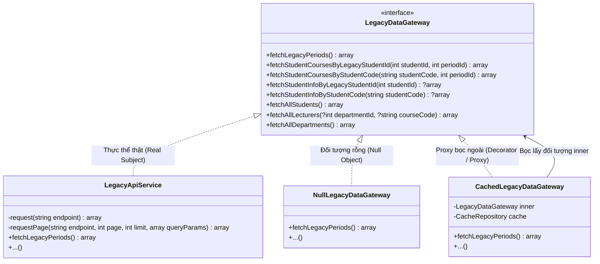
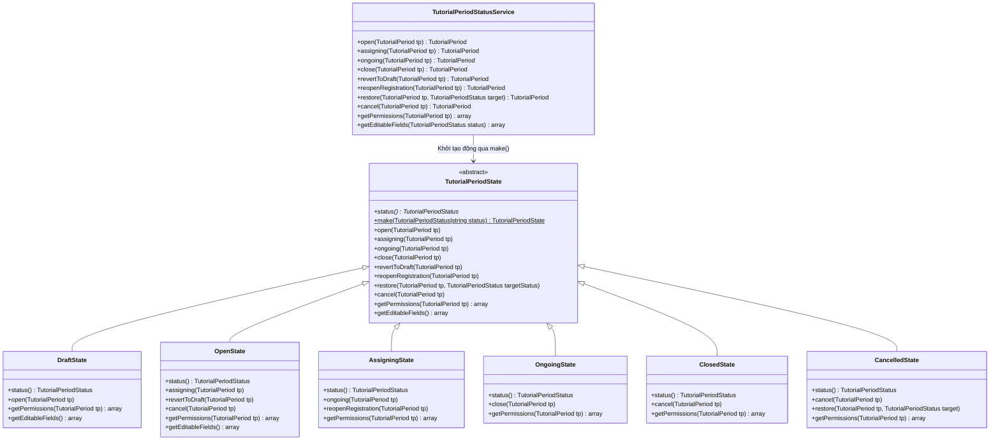
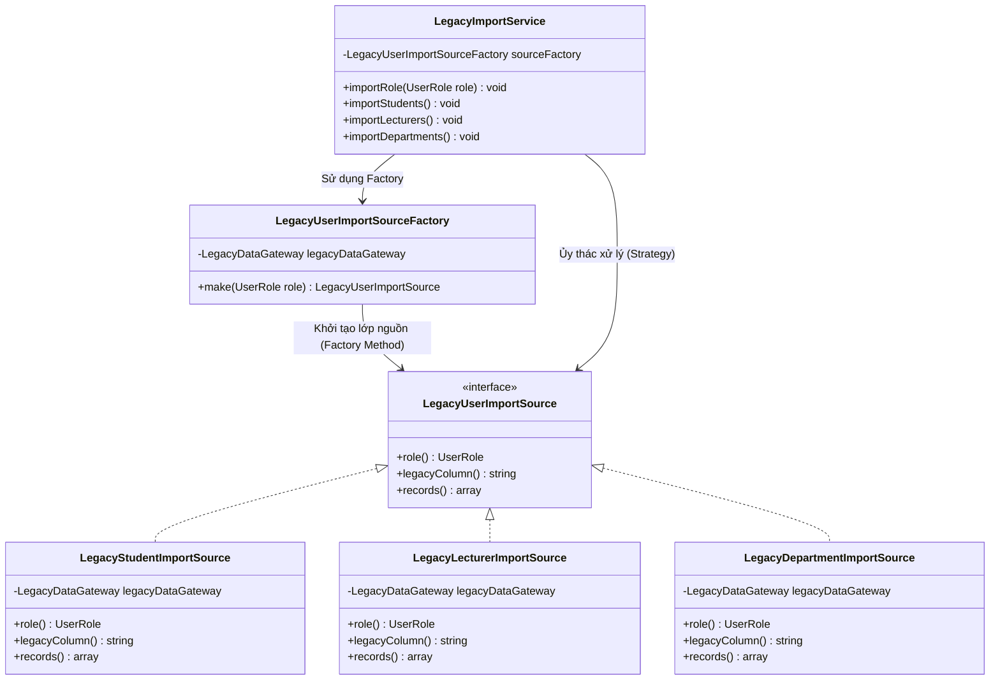
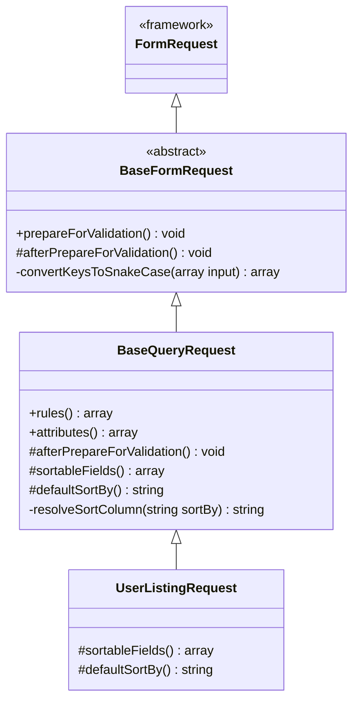
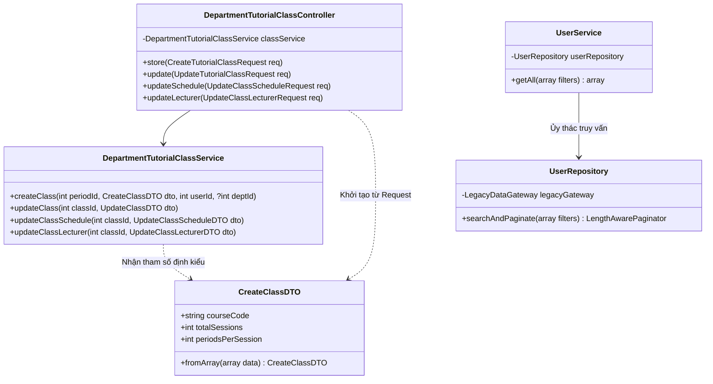

# Sơ Đồ Lớp (Class Diagram) - Các Mẫu Thiết Kế Trong Dự Án

Tài liệu này tổng hợp các sơ đồ lớp (Class Diagram) vẽ bằng Mermaid để mô tả trực quan cấu trúc của các mẫu thiết kế đang được áp dụng trong dự án.

---

## 1. Decorator / Proxy Pattern & Null Object Pattern
Mẫu thiết kế này bọc tầng tích hợp API hệ thống cũ để quản lý cache (`CachedLegacyDataGateway`) và cung cấp một đối tượng rỗng (`NullLegacyDataGateway`) làm phương án dự phòng khi hệ thống cũ không hoạt động hoặc không được cấu hình.

---

## 2. State Pattern
Mẫu thiết kế quản lý trạng thái của đợt học phụ đạo (`TutorialPeriod`). Toàn bộ logic rẽ nhánh, kiểm tra hợp lệ, phân quyền và xác định các cột được phép sửa được chuyển giao trực tiếp cho các lớp trạng thái kế thừa.

---

## 3. Factory Method Pattern & Strategy Pattern
Các mẫu thiết kế xử lý đồng bộ hóa tài khoản từ cơ sở dữ liệu cũ sang hệ thống mới thông qua các lớp nguồn đồng bộ hóa khác nhau.

---

## 4. Template Method Pattern
Khung xử lý logic chuẩn hóa dữ liệu yêu cầu trước khi xác thực đầu vào. Lớp cơ sở định nghĩa thuật toán chuẩn, các lớp con chỉ định nghĩa/ghi đè cấu hình hoặc hook cụ thể.

---

## 5. DTO & Repository Pattern
Sử dụng DTO để làm sạch, định kiểu dữ liệu truyền nhận giữa Controller và Service. Sử dụng Repository để đóng gói, tách biệt logic truy vấn cơ sở dữ liệu ra khỏi logic nghiệp vụ của Service.

