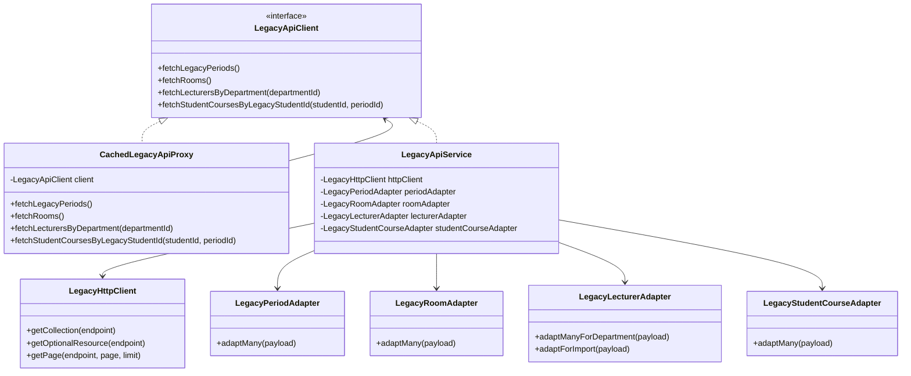
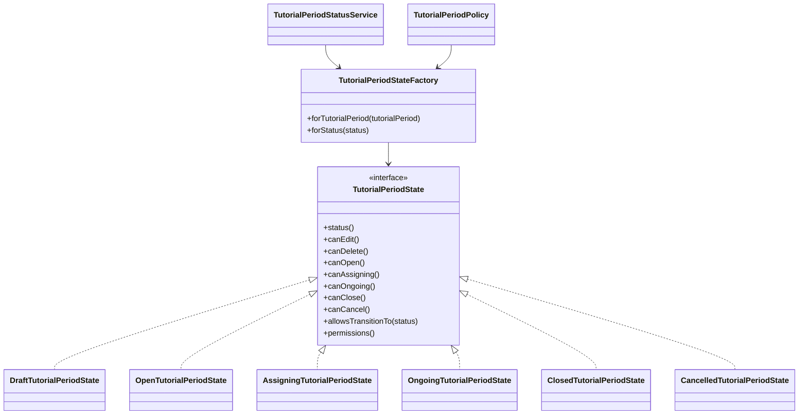
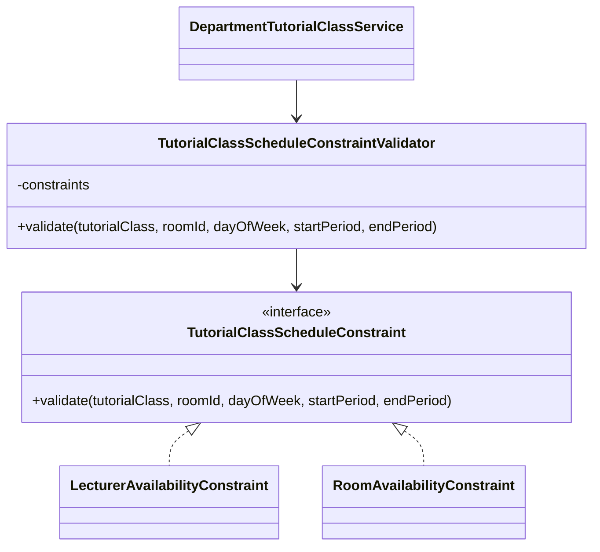
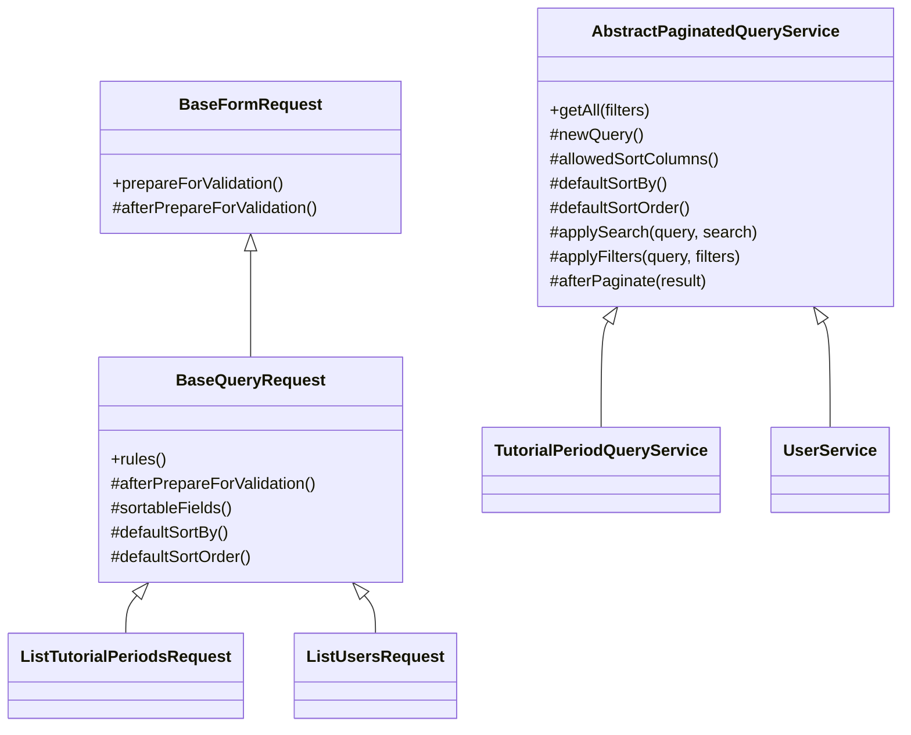

# Design Patterns Applied

This document records the concrete design-pattern refactors applied in the current codebase without changing the existing public API contract.

## Applied Patterns

| Chuc nang | Pattern ap dung | File/Class chinh | Muc dich ap dung | Loi ich |
| --- | --- | --- | --- | --- |
| Tich hop Legacy API | Adapter + Proxy | `LegacyApiService`, `LegacyHttpClient`, `CachedLegacyApiProxy`, `app/Services/External/Adapters/*` | Chuan hoa du lieu legacy va them lop cache trung gian | Giam phu thuoc vao raw payload, de cache, de mo rong retry/logging |
| Workflow dot phu dao | State | `TutorialPeriodStateFactory`, `app/States/TutorialPeriods/*`, `TutorialPeriodStatusService`, `TutorialPeriodPolicy` | Gom rule theo tung status | Giam logic if/else rai rac o policy, service, resource |
| Query flow chung | Template Method | `BaseQueryRequest`, `AbstractPaginatedQueryService`, `UserService`, `TutorialPeriodQueryService` | Chuan hoa normalize sort/filter/paginate | Giam lap code va giu mot flow dong nhat |
| Xep lich lop phu dao | Strategy | `TutorialClassScheduleConstraintValidator`, `LecturerAvailabilityConstraint`, `RoomAvailabilityConstraint` | Tach tung rule conflict khi xep lich | Service chinh gon hon, de them rule moi |
| Xac thuc/phan quyen request | Chain of Responsibility | `routes/api.php`, `RequireAuth.tsx`, `RequireRole.tsx`, `authApiKey.ts`, `validate.ts` | Giu luong auth/validation ro rang | Khong can refactor manh vi chain da dung dung vai tro |

## Mermaid Diagrams

### Adapter + Proxy

### State

### Strategy

### Template Method

