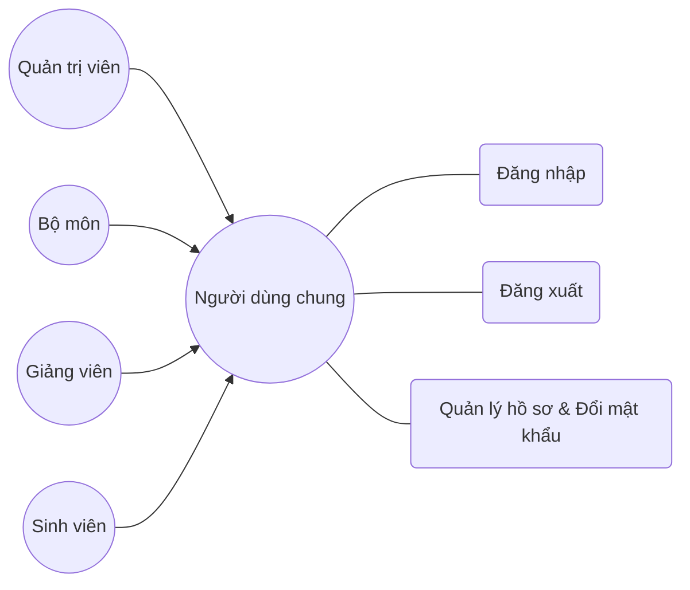
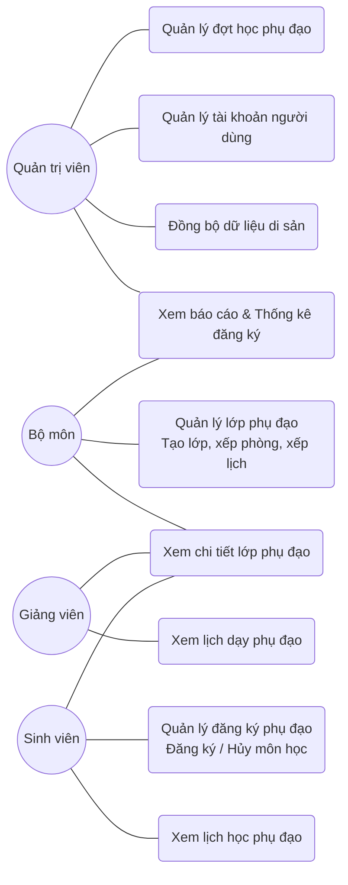

# Tài Liệu Đặc Tả Use Case Hệ Thống Đăng Ký Học Phụ Đạo

Tài liệu này đặc tả chi tiết toàn bộ danh sách Use Case (từ UC_01 đến UC_32) của hệ thống đăng ký học phụ đạo dành cho sinh viên quốc tế. Danh sách này được xây dựng và chuẩn hóa dựa trên cấu trúc mã nguồn thực tế (Laravel Core Backend) và các ràng buộc nghiệp vụ hiện tại của dự án.

---

## 1. Các Tác Nhân Trong Hệ Thống (System Actors)

*   **Người dùng chung (User):** Tác nhân cha trừu tượng đại diện cho mọi tài khoản đăng nhập vào hệ thống.
*   **Quản trị viên (Admin):** Thực hiện quản trị đợt học phụ đạo, quản lý tài khoản người dùng và đồng bộ dữ liệu di sản qua CLI.
*   **Bộ môn (Department):** Thực hiện điều phối, tạo lớp học phụ đạo, xếp phòng/lịch học, phân công giảng viên và theo dõi thống kê số liệu của bộ môn mình phụ trách.
*   **Sinh viên (Student):** Thực hiện đăng ký/hủy học phụ đạo và xem thời khóa biểu học tập cá nhân.
*   **Giảng viên (Lecturer):** Xem lịch dạy và thông tin các lớp học phụ đạo được phân công giảng dạy.

---

## 2. Sơ Đồ Use Case Phân Hệ Tổng Quát (Mermaid Diagrams)

### 2.1. Phân Hệ Chức Năng Chung Hệ Thống (General System Functions)
Mô tả các hành động cơ bản kế thừa chung, có sự phân cấp rõ ràng từ tác nhân `Người dùng chung` xuống các người dùng cụ thể.

---

### 2.2. Phân Hệ Chức Năng Nghiệp Vụ Riêng Biệt (Role-Specific Business Functions)
Mô tả các nghiệp vụ cốt lõi dành riêng cho từng vai trò mà không cần liên kết lại tác nhân `Người dùng chung`, giúp sơ đồ cực kỳ sạch sẽ và dễ theo dõi.

---

## 3. Bảng Đặc Tả Chi Tiết Toàn Bộ Use Case Hệ Thống (UC_01 - UC_32)

Dưới đây là tài liệu đặc tả chi tiết từng Use Case cụ thể trong hệ thống, được phân loại theo phân hệ chức năng và ánh xạ trực tiếp đến các Class, Method xử lý trong mã nguồn Laravel Backend hiện tại.

### 3.1. Phân Hệ 1: Chức Năng Chung Hệ Thống (General Subsystem)

| Mã UC | Tên Use Case | Tác nhân chính | Đặc tả nghiệp vụ & Ràng buộc thực tế trong Code | Class & Method xử lý chính |
| :---: | :--- | :--- | :--- | :--- |
| **UC_01** | Đăng nhập | Người dùng chung | Nhập tài khoản/mật khẩu để truy cập hệ thống. Hạn chế tần suất đăng nhập sai (Rate limiting) tối đa 5 lần/phút theo IP và username. | - [AuthController@login](file:///d:/tutoring-system/apps/core-backend/app/Http/Controllers/Api/V1/AuthController.php) - Middleware: `throttle:login` |
| **UC_02** | Đăng xuất | Người dùng chung | Hủy phiên làm việc hiện tại, thu hồi token đăng nhập thông qua Laravel Sanctum. | - [AuthController@logout](file:///d:/tutoring-system/apps/core-backend/app/Http/Controllers/Api/V1/AuthController.php) |
| **UC_03** | Xem thông tin cá nhân & Đổi mật khẩu | Người dùng chung | Cho phép người dùng tự xem thông tin hồ sơ cá nhân và tự cập nhật mật khẩu của chính mình. | - [AuthController@me](file:///d:/tutoring-system/apps/core-backend/app/Http/Controllers/Api/V1/AuthController.php) - [UserController@updatePassword](file:///d:/tutoring-system/apps/core-backend/app/Http/Controllers/Api/V1/UserController.php) |

---

### 3.2. Phân Hệ 2: Quản Lý Đợt Học Phụ Đạo (Tutorial Period Management - Admin)

| Mã UC | Tên Use Case | Tác nhân chính | Đặc tả nghiệp vụ & Ràng buộc thực tế trong Code | Class & Method xử lý chính |
| :---: | :--- | :--- | :--- | :--- |
| **UC_04** | Xem danh sách đợt học | Quản trị viên | Hiển thị danh sách các đợt học phụ đạo hiện có trong hệ thống, bao gồm cả đợt học đã bị xóa mềm (nếu có). | - [TutorialPeriodController@index](file:///d:/tutoring-system/apps/core-backend/app/Http/Controllers/Api/V1/TutorialPeriodController.php) |
| **UC_05** | Tạo đợt học mới | Quản trị viên | Tạo đợt học phụ đạo mới trong hệ thống. Trạng thái đợt học ban đầu mặc định được gán là **`DRAFT`** (Nháp). | - [TutorialPeriodController@store](file:///d:/tutoring-system/apps/core-backend/app/Http/Controllers/Api/V1/TutorialPeriodController.php) |
| **UC_06** | Cập nhật thông tin đợt học | Quản trị viên | Cho phép sửa đổi tiêu đề, mô tả, thời gian đăng ký và học tập. **Chỉ được phép thực hiện** khi đợt học ở trạng thái `DRAFT` hoặc `OPEN`. | - [TutorialPeriodController@update](file:///d:/tutoring-system/apps/core-backend/app/Http/Controllers/Api/V1/TutorialPeriodController.php) |
| **UC_07** | Mở đợt đăng ký (Open) | Quản trị viên | Chuyển trạng thái đợt học từ `DRAFT` sang **`OPEN`** để bắt đầu nhận đăng ký học từ Sinh viên. | - [TutorialPeriodController@open](file:///d:/tutoring-system/apps/core-backend/app/Http/Controllers/Api/V1/TutorialPeriodController.php) - [TutorialPeriodStatusService@open](file:///d:/tutoring-system/apps/core-backend/app/Services/TutorialPeriods/TutorialPeriodStatusService.php) |
| **UC_08** | Chuyển sang Phân công (Assigning) | Quản trị viên | Chuyển đợt học từ `OPEN` sang **`ASSIGNING`** để kích hoạt chức năng lập lớp và điều phối lịch giảng dạy cho Bộ môn. | - [TutorialPeriodController@assigning](file:///d:/tutoring-system/apps/core-backend/app/Http/Controllers/Api/V1/TutorialPeriodController.php) - [TutorialPeriodStatusService@assigning](file:///d:/tutoring-system/apps/core-backend/app/Services/TutorialPeriods/TutorialPeriodStatusService.php) |
| **UC_09** | Chuyển sang Đang dạy (Ongoing) | Quản trị viên | Chuyển đợt học từ `ASSIGNING` sang **`ONGOING`** để khóa chức năng lập lịch của Bộ môn và đưa đợt học vào học tập thực tế. | - [TutorialPeriodController@ongoing](file:///d:/tutoring-system/apps/core-backend/app/Http/Controllers/Api/V1/TutorialPeriodController.php) - [TutorialPeriodStatusService@ongoing](file:///d:/tutoring-system/apps/core-backend/app/Services/TutorialPeriods/TutorialPeriodStatusService.php) |
| **UC_10** | Đóng đợt học (Close) | Quản trị viên | Chuyển trạng thái đợt học từ `ONGOING` sang **`CLOSED`** khi đợt học phụ đạo kết thúc. | - [TutorialPeriodController@close](file:///d:/tutoring-system/apps/core-backend/app/Http/Controllers/Api/V1/TutorialPeriodController.php) - [TutorialPeriodStatusService@close](file:///d:/tutoring-system/apps/core-backend/app/Services/TutorialPeriods/TutorialPeriodStatusService.php) |
| **UC_11** | Hủy đợt học (Cancel) | Quản trị viên | Hủy đợt học phụ đạo trước khi kết thúc đợt học. Chuyển đợt học sang trạng thái **`CANCELLED`**. | - [TutorialPeriodController@cancel](file:///d:/tutoring-system/apps/core-backend/app/Http/Controllers/Api/V1/TutorialPeriodController.php) - [TutorialPeriodStatusService@cancel](file:///d:/tutoring-system/apps/core-backend/app/Services/TutorialPeriods/TutorialPeriodStatusService.php) |
| **UC_12** | Khôi phục đợt học đã hủy (Restore) | Quản trị viên | Phục hồi đợt học đang ở trạng thái `CANCELLED` quay về trạng thái **`DRAFT`** để Admin tái cấu hình. | - [TutorialPeriodController@restore](file:///d:/tutoring-system/apps/core-backend/app/Http/Controllers/Api/V1/TutorialPeriodController.php) - [TutorialPeriodStatusService@restore](file:///d:/tutoring-system/apps/core-backend/app/Services/TutorialPeriods/TutorialPeriodStatusService.php) |
| **UC_13** | Xóa đợt học | Quản trị viên | Xóa mềm đợt học phụ đạo khỏi hệ thống. **Chỉ được phép thực hiện** khi đợt học ở trạng thái `DRAFT`, `CLOSED` hoặc `CANCELLED`. | - [TutorialPeriodController@destroy](file:///d:/tutoring-system/apps/core-backend/app/Http/Controllers/Api/V1/TutorialPeriodController.php) |

---

### 3.3. Phân Hệ 3: Quản Lý Người Dùng & Đồng Bộ Hệ Thống (Admin User & Sync)

| Mã UC | Tên Use Case | Tác nhân chính | Đặc tả nghiệp vụ & Ràng buộc thực tế trong Code | Class & Method xử lý chính |
| :---: | :--- | :--- | :--- | :--- |
| **UC_14** | Xem danh sách tài khoản | Quản trị viên | Xem danh sách toàn bộ tài khoản người dùng, hỗ trợ phân trang, tìm kiếm theo tên/mã và lọc theo vai trò (Sinh viên, Giảng viên, Bộ môn, Admin). | - [UserController@index](file:///d:/tutoring-system/apps/core-backend/app/Http/Controllers/Api/V1/UserController.php) - [UserRepository@getAll](file:///d:/tutoring-system/apps/core-backend/app/Repositories/UserRepository.php) |
| **UC_15** | Đặt lại mật khẩu người dùng | Quản trị viên | Cho phép Admin đặt lại mật khẩu cho bất kỳ tài khoản người dùng nào trong hệ thống. | - [UserController@updatePassword](file:///d:/tutoring-system/apps/core-backend/app/Http/Controllers/Api/V1/UserController.php) - [UserService@updatePassword](file:///d:/tutoring-system/apps/core-backend/app/Services/Users/UserService.php) |
| **UC_16** | Đồng bộ tài khoản từ hệ thống cũ | Quản trị viên | Kéo tự động và đồng bộ danh sách Bộ môn, Giảng viên, Sinh viên từ SQL Server di sản qua cổng API của Express Backend. Kích hoạt an toàn thông qua CLI. | - [ImportLegacyUsersCommand](file:///d:/tutoring-system/apps/core-backend/app/Console/Commands/ImportLegacyUsersCommand.php) - [LegacyImportService](file:///d:/tutoring-system/apps/core-backend/app/Services/LegacyImportService.php) |

---

### 3.4. Phân Hệ 4: Đăng Ký Học Tập (Student Registration)

| Mã UC | Tên Use Case | Tác nhân chính | Đặc tả nghiệp vụ & Ràng buộc thực tế trong Code | Class & Method xử lý chính |
| :---: | :--- | :--- | :--- | :--- |
| **UC_17** | Xem thông tin đợt học khả dụng | Sinh viên | Sinh viên xem danh sách các đợt học đang mở đăng ký. | - [StudentTutorialPeriodController@index](file:///d:/tutoring-system/apps/core-backend/app/Http/Controllers/Api/V1/StudentTutorialPeriodController.php) |
| **UC_18** | Xem danh sách môn học khả dụng | Sinh viên | Xem danh sách các môn học đủ điều kiện đăng ký học phụ đạo trong đợt học. | - [StudentTutorialPeriodCourseController@index](file:///d:/tutoring-system/apps/core-backend/app/Http/Controllers/Api/V1/StudentTutorialPeriodCourseController.php) |
| **UC_19** | Đăng ký môn học phụ đạo | Sinh viên | Thực hiện gửi yêu cầu đăng ký học phụ đạo. **Ràng buộc:** Chỉ cho phép đăng ký khi đợt học ở trạng thái **`OPEN`** và thời gian hiện tại nằm trong hạn đăng ký. | - [StudentTutorialRegistrationController@store](file:///d:/tutoring-system/apps/core-backend/app/Http/Controllers/Api/V1/StudentTutorialRegistrationController.php) - [StudentTutorialRegistrationService@registerCourse](file:///d:/tutoring-system/apps/core-backend/app/Services/TutorialPeriods/StudentTutorialRegistrationService.php) |
| **UC_20** | Hủy đăng ký môn học phụ đạo | Sinh viên | Hủy môn học đã đăng ký học phụ đạo. **Ràng buộc:** Chỉ cho phép hủy khi đợt học ở trạng thái **`OPEN`** và trong hạn đăng ký. | - [StudentTutorialRegistrationController@destroy](file:///d:/tutoring-system/apps/core-backend/app/Http/Controllers/Api/V1/StudentTutorialRegistrationController.php) - [StudentTutorialRegistrationService@cancelRegistration](file:///d:/tutoring-system/apps/core-backend/app/Services/TutorialPeriods/StudentTutorialRegistrationService.php) |
| **UC_21** | Xem lịch học cá nhân | Sinh viên | Xem thời khóa biểu các buổi học phụ đạo của các môn đã đăng ký học thành công. | - [StudentStudyScheduleController@index](file:///d:/tutoring-system/apps/core-backend/app/Http/Controllers/Api/V1/StudentStudyScheduleController.php) - [StudentStudyScheduleService@getStudySchedule](file:///d:/tutoring-system/apps/core-backend/app/Services/TutorialPeriods/StudentStudyScheduleService.php) |

---

### 3.5. Phân Hệ 5: Quản Lý & Điều Phối Lớp Học (Department Class Management)

| Mã UC | Tên Use Case | Tác nhân chính | Đặc tả nghiệp vụ & Ràng buộc thực tế trong Code | Class & Method xử lý chính |
| :---: | :--- | :--- | :--- | :--- |
| **UC_22** | Xem danh sách lớp phụ đạo | Bộ môn | Xem danh sách các lớp học phụ đạo do bộ môn mình phụ trách quản lý trong đợt học. | - [DepartmentTutorialClassController@index](file:///d:/tutoring-system/apps/core-backend/app/Http/Controllers/Api/V1/DepartmentTutorialClassController.php) |
| **UC_23** | Tạo lớp phụ đạo mới | Bộ môn | Tạo lớp học phụ đạo mới cho môn học có sinh viên đăng ký. **Ràng buộc:** Chỉ cho phép thực hiện khi đợt học tương ứng đang ở trạng thái **`ASSIGNING`**. | - [DepartmentTutorialClassController@store](file:///d:/tutoring-system/apps/core-backend/app/Http/Controllers/Api/V1/DepartmentTutorialClassController.php) - [DepartmentTutorialClassService@createClass](file:///d:/tutoring-system/apps/core-backend/app/Services/TutorialPeriods/DepartmentTutorialClassService.php) |
| **UC_24** | Cập nhật thông tin lớp học | Bộ môn | Sửa đổi tổng số buổi học, số tiết trên một buổi của lớp học phụ đạo. | - [DepartmentTutorialClassController@update](file:///d:/tutoring-system/apps/core-backend/app/Http/Controllers/Api/V1/DepartmentTutorialClassController.php) - [DepartmentTutorialClassService@updateClass](file:///d:/tutoring-system/apps/core-backend/app/Services/TutorialPeriods/DepartmentTutorialClassService.php) |
| **UC_25** | Xếp lịch học & phòng học | Bộ môn | Xếp Thứ, Tiết học bắt đầu và Phòng học cho lớp phụ đạo. **Ràng buộc:** Hệ thống tự động kiểm tra trùng phòng học (không cho xếp 2 lớp trùng phòng, trùng thứ, trùng tiết). | - [DepartmentTutorialClassController@updateSchedule](file:///d:/tutoring-system/apps/core-backend/app/Http/Controllers/Api/V1/DepartmentTutorialClassController.php) - [DepartmentTutorialClassService@updateClassSchedule](file:///d:/tutoring-system/apps/core-backend/app/Services/TutorialPeriods/DepartmentTutorialClassService.php) |
| **UC_26** | Phân công giảng viên giảng dạy | Bộ môn | Gán giảng viên phụ trách giảng dạy cho lớp học phụ đạo. **Ràng buộc:** Hệ thống tự động kiểm tra trùng lịch dạy của giảng viên trước khi gán. | - [DepartmentTutorialClassController@updateLecturer](file:///d:/tutoring-system/apps/core-backend/app/Http/Controllers/Api/V1/DepartmentTutorialClassController.php) - [DepartmentTutorialClassService@updateClassLecturer](file:///d:/tutoring-system/apps/core-backend/app/Services/TutorialPeriods/DepartmentTutorialClassService.php) |
| **UC_27** | Hủy lớp phụ đạo | Bộ môn | Hủy lớp học phụ đạo trong đợt học hoạt động. Trạng thái lớp chuyển sang `CANCELLED`. | - [DepartmentTutorialClassController@cancel](file:///d:/tutoring-system/apps/core-backend/app/Http/Controllers/Api/V1/DepartmentTutorialClassController.php) - [DepartmentTutorialClassService@cancelClass](file:///d:/tutoring-system/apps/core-backend/app/Services/TutorialPeriods/DepartmentTutorialClassService.php) |
| **UC_28** | Khôi phục lớp phụ đạo đã hủy | Bộ môn | Phục hồi lớp học đã bị hủy trước đó về trạng thái hoạt động bình thường trong đợt học. | - [DepartmentTutorialClassController@restore](file:///d:/tutoring-system/apps/core-backend/app/Http/Controllers/Api/V1/DepartmentTutorialClassController.php) - [DepartmentTutorialClassService@restoreClass](file:///d:/tutoring-system/apps/core-backend/app/Services/TutorialPeriods/DepartmentTutorialClassService.php) |
| **UC_29** | Xem thống kê đăng ký môn học | Bộ môn, Admin | Xem thống kê tổng hợp số lượng sinh viên đã đăng ký học của từng môn trong đợt để làm căn cứ lập lớp. | - [DepartmentTutorialRegistrationController@index](file:///d:/tutoring-system/apps/core-backend/app/Http/Controllers/Api/V1/DepartmentTutorialRegistrationController.php) - [DepartmentTutorialRegistrationService@getCourseRegistrationSummary](file:///d:/tutoring-system/apps/core-backend/app/Services/TutorialPeriods/DepartmentTutorialRegistrationService.php) |
| **UC_30** | Xem danh sách sinh viên đăng ký môn | Bộ môn | Xem danh sách chi tiết các sinh viên đã thực hiện đăng ký môn học phụ đạo. | - [DepartmentTutorialRegistrationController@students](file:///d:/tutoring-system/apps/core-backend/app/Http/Controllers/Api/V1/DepartmentTutorialRegistrationController.php) - [DepartmentTutorialRegistrationService@getRegisteredStudents](file:///d:/tutoring-system/apps/core-backend/app/Services/TutorialPeriods/DepartmentTutorialRegistrationService.php) |

---

### 3.6. Phân Hệ 6: Lịch Giảng Dạy & Chi Tiết Lớp Học (Lecturer & Shared)

| Mã UC | Tên Use Case | Tác nhân chính | Đặc tả nghiệp vụ & Ràng buộc thực tế trong Code | Class & Method xử lý chính |
| :---: | :--- | :--- | :--- | :--- |
| **UC_31** | Xem lịch dạy phụ đạo | Giảng viên | Xem thời khóa biểu các lớp học phụ đạo được phân công dạy trong các đợt học hoạt động. | - [LecturerTeachingScheduleController@index](file:///d:/tutoring-system/apps/core-backend/app/Http/Controllers/Api/V1/LecturerTeachingScheduleController.php) - [LecturerTeachingScheduleService@getTeachingSchedule](file:///d:/tutoring-system/apps/core-backend/app/Services/TutorialPeriods/LecturerTeachingScheduleService.php) |
| **UC_32** | Xem chi tiết lớp phụ đạo | Sinh viên, Giảng viên, Bộ môn | Xem chi tiết lớp học (phòng học, danh sách lịch học chi tiết các buổi, giảng viên phụ trách, số sinh viên tham gia). | - [StudentTutorialRegistrationInfoController@index](file:///d:/tutoring-system/apps/core-backend/app/Http/Controllers/Api/V1/StudentTutorialRegistrationInfoController.php) - [StudentTutorialRegistrationInfoService@getRegistrationInfo](file:///d:/tutoring-system/apps/core-backend/app/Services/TutorialPeriods/StudentTutorialRegistrationInfoService.php) |
